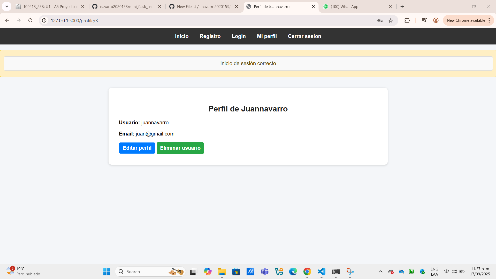

# Mini Flask Users

Mini-sistema web desarrollado con **Flask**, **Jinja2**, **SQLAlchemy** y **MySQL** para la gestión de usuarios.  
Incluye registro, login, perfil, edición y eliminación de usuarios, siguiendo el patrón **MVC** y usando **plantillas dinámicas**.

---

## Funcionalidades
- Registro de usuarios con validación y hash de contraseña.
- Inicio de sesión con sesión de Flask.
- Lista de usuarios registrados.
- Perfil de usuario con edición y eliminación.
- Uso de mensajes flash para notificaciones.
- Plantillas con extensión (``) y filtros de Jinja2.
- Estilos aplicados con un único `style.css`.

---

## Tecnologías usadas
- Python + Flask
- Jinja2
- SQLAlchemy + Flask-Migrate
- PyMySQL
- HTML + CSS

---

## Estructura del proyecto
mini_flask_user/
│── app.py
│── config.py
│── models/
│ └── user.py
│── routes/
│ └── user_routes.py
│── templates/
│ ├── base.html
│ ├── register.html
│ ├── login.html
│ ├── user_list.html
│ ├── profile.html
│ └── edit_profile.html
│── static/
│ └── style.css
│── migrations/
│── screenshots/ capturas de pantalla
│── requirements.txt
│── README.md


---

## Capturas de pantalla

### Registro


### Login


### Lista de usuarios


### Perfil de usuario


### Edición de usuario


### Eliminación de usuario


---

## Instalación y ejecución
```bash
git clone https://github.com/navarro2020153/mini_flask_users.git
cd mini_flask_users
python -m venv venv
venv\Scripts\activate   # en Windows
pip install -r requirements.txt
flask db upgrade
flask run

